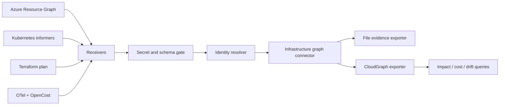

# OpenTelemetry Infrastructure Graph Collector

## CloudGraph Collector

**OpenTelemetry-shaped multi-cloud infrastructure discovery for Azure, Kubernetes, Terraform/OpenTofu, OpenCost, AIOps, FinOps and infrastructure knowledge graphs.**

CloudGraph Collector normalizes cloud assets, Kubernetes state, IaC plans, service telemetry and cost observations into provenance-preserving infrastructure graph batches. It is the collection and identity layer for [CloudGraph](https://github.com/AAH20/cloud-infrastructure-knowledge-graph).

```text
Azure + Kubernetes + Terraform + OpenTelemetry + OpenCost
                           ↓
               receiver and adapter boundary
                           ↓
       secret gate + identity resolution + deduplication
                           ↓
       observed / declared / calculated / inferred edges
                           ↓
        CloudGraph, JSON evidence or graph database
```

> **Claim boundary:** v0.1 contains an executable Go normalization pipeline, offline fixtures, security gates, evidence receipts and an upstream-shaped distribution contract. It is not yet compiled into the upstream OpenTelemetry Collector component model and does not call Azure, Kubernetes, Terraform or OpenCost APIs. The example Collector configuration and OCB manifest are clearly marked roadmap contracts.

## Run the executable proof

```bash
go test ./...
go run ./cmd/cloudgraph-collector \
  --input examples/azure-aks-batch.json \
  --output generated/graph-batch.json
```

The fixture combines observations representing Azure Resource Graph, Kubernetes, Backstage, Terraform plans and OpenCost. The pipeline emits a sorted deterministic graph batch and operational metrics.

## Implemented

- normalized observation and relationship contracts;
- strict cross-source identity collision rejection;
- dangling-edge rejection;
- secret-like attribute rejection;
- duplicate observation and relationship suppression;
- explicit `observed`, `declared`, `calculated` and `inferred` evidence classes;
- inferred relationships disabled by default;
- deterministic ordering and SHA-256 receipt;
- owner-coverage and pipeline-integrity metrics;
- five automated tests and CI evidence artifacts.

## Planned collector components

| Component | Production responsibility |
|---|---|
| `azureassetreceiver` | Azure Resource Graph, relationships, Private Link, identity and metadata |
| `k8sgraphreceiver` | Workloads, Services, Gateway API, ownership and runtime placement |
| `terraformplanreceiver` | Terraform/OpenTofu plan changes and declared dependencies—never apply |
| `otelservicegraphreceiver` | Correlate service telemetry with infrastructure identities |
| `opencostreceiver` | Cost observations connected to workloads and business services |
| `infrastructuregraphconnector` | Normalize identities, provenance, freshness and graph batches |
| `cloudgraphexporter` | Export authorized graph observations and receipts |

## Production architecture



The collector must use least-privilege read scopes, retain source timestamps and native identifiers, bound cardinality and backpressure, and keep tenant data isolated. Model inference cannot silently create authoritative graph edges.

## Distribution

The adoption target is a first useful graph in under ten minutes through:

- Go binary and GHCR container;
- OpenTelemetry Collector Builder distribution;
- Helm chart and Kubernetes RBAC;
- Terraform plan GitHub Action;
- read-only local file export;
- connector SDK and conformance fixtures;
- CloudGraph and OpenCypher exporters.

An upstream contribution should be split into focused, independently reviewable components after the interfaces, telemetry, security model and benchmarks are production-tested.

## KPIs

- time to first graph;
- observations processed per second;
- CPU and memory per 10,000 entities;
- graph freshness;
- identity collision and duplicate rates;
- secret-rejection count;
- dependency precision and recall;
- owner and cost-allocation coverage;
- Terraform-plan mapping coverage;
- exporter retry and data-loss rate;
- relationship cardinality growth;
- secrets collected: mandatory zero.

## Portfolio integration

CloudGraph Collector observes infrastructure; CloudGraph connects and queries it; the [Agentic Cloud Solution Engineering Factory](https://github.com/AAH20/agentic-cloud-solution-engineering-factory) designs changes; the [Kubernetes AI Agent Operator](https://github.com/AAH20/kubernetes-ai-agent-operator) isolates validation; the [Multi-Cloud Infrastructure Control Loop](https://github.com/AAH20/multicloud-infrastructure-control-loop) evaluates remediation.

## Call to action

Bring an Azure/Kubernetes topology or Terraform plan that lacks reliable ownership, cost or dependency context. [Request a CloudGraph architecture review](https://a2zsoc.com/contact?topic=cloudgraph-collector&utm_source=github&utm_medium=repository).

## License

Apache-2.0.
